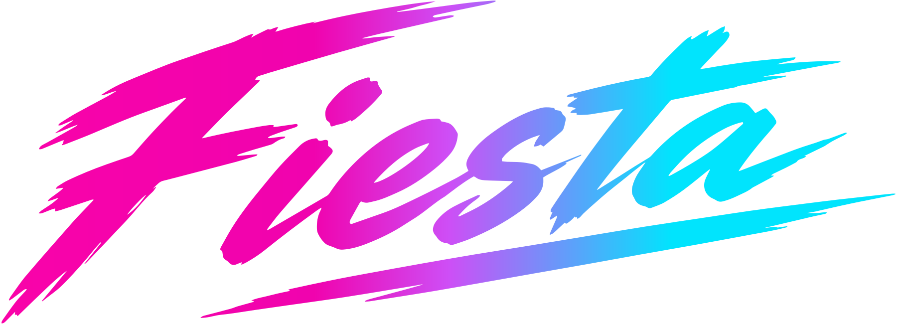
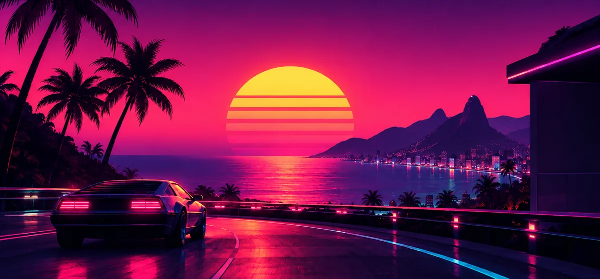

<div align="center">

🌐 **[println.github.io/fiesta](https://println.github.io/fiesta/)**

🇺🇸 English · [🇧🇷 Português](README.pt-BR.md)



# More road. Fewer limits.

**Hands on the wheel, eyes on the road, and freedom for your media.**

Drive. Explore. Play.

</div>

---

You start the car, and the music picks up where it left off. You press the steering wheel
button, and the track skips. You say "Hey Google, play synthwave on Fiesta", and it's playing.
The map stays on screen, the sound stays on air.

This is **Fiesta**: a **driving-first** app for Android Auto, made for people who love to
drive. Fewer taps. More road.

## Made for driving

### 🎛️ The wheel is in charge
Play, pause, next and previous straight from the car's buttons. No hunting on the screen.

### 🎙️ Just ask
"Play X on Fiesta" through Google Assistant. You ask, Fiesta finds it and plays it.

### 🌙 Screen off, sound on
Fiesta plays in the background, in the Android Auto media card, with artwork, title and queue.
The map in front; the soundtrack behind it.

### 🔁 Picks up where you left off
Turned the car off mid-song? On your next drive, it comes back on its own, from the same spot.

### 🧭 Your dashboard, your way
Every car has its own screen, and Fiesta fits it. The toolbar goes to the top, bottom, left or
right, and can hide so the page takes the whole screen, coming back with a tap on the edge.
The **bookmarks bar** keeps your sites one tap away, and any bookmark becomes the home page
right there. Zoom to read from the driver's seat. And all of it can be tuned **from your
phone, live**.

### 🛡️ Yours, and only yours
No telemetry: CarStream shipped Firebase, Fiesta sends nothing, to anyone. Known ad and
tracking domains are blocked by default, per site. Sites you sign into still know it's you.

### 🧩 Ready for any site
Per-site plugins teach Fiesta how to talk to each page: what the wheel does, what the screen
shows. Pluggable search engines and per-site desktop mode round it out.

## The look

Fiesta is born from the **Night Drive** mood: roads at night, **JDM** culture and
**retrofuturism**, with influences from **Akira, Midnight Club, Enduro, synthwave and Vice
City**. Neon, speed and freedom: a look inspired by the past, made for the road.

Every version carries a codename from that road. The first one is **1.0.0 · Akira**.

## Fiesta × CarStream

Fiesta was born from [CarStream](https://github.com/thekirankumar/carstream-android-auto) and
rebuilt with the road in mind.

| Feature | **Fiesta** | CarStream |
| --- | :---: | :---: |
| Controls from the steering wheel buttons | **✅** | — |
| "Play X on Fiesta" through Google Assistant | **✅** | — |
| Music and video in the Android Auto media card | **✅** | — |
| Keeps playing with the map on screen | **✅** | — |
| Resumes where it stopped when you start the car | **✅** | — |
| Playback queue on the dashboard | **✅** | — |
| Toolbar wherever you want: top, bottom, left or right | **✅** | — |
| Toolbar that hides and comes back with a tap on the edge | **✅** | — |
| Bookmarks bar on the car screen, on or off | **✅** | — |
| Bookmark the page from the car and make any bookmark the home page in one tap | **✅** | — |
| Page zoom to read from the driver's seat | **✅** | — |
| Per-site plugins ([`docs/plugins.md`](docs/plugins.md)) | **✅** | — |
| Ad and tracker blocker, per site | **✅** | — |
| Per-site desktop mode | **✅** | — |
| Pluggable search engines | **✅** | — |
| Send a page from the phone to the car | **✅** | — |
| Tune the car from the phone, live | **✅** | — |
| Phone browser inspired by Firefox Focus | **✅** | — |
| Control over each site's data | **✅** | — |
| No telemetry (CarStream shipped Firebase) | **✅** | — |
| Voice search on the app screen | **✅** | ✅ |
| Browser on the car screen | **✅** | ✅ |
| Full-screen video with aspect ratio control | **✅** | ✅ |
| Keyboard and search suggestions in the car | **✅** | ✅ |
| Bookmarks | **✅** | ✅ |
| Unlock mode for rooted phones | **✅** | ✅ |
| Local file player | **—** | ✅ |
| Night mode through remote CSS | **—** | ✅ |

## ⛽ Fuel up Fiesta

<div align="center">



</div>

Fiesta is **free**, with **no ads** and **no telemetry**. It's made in spare time, running on
coffee and on the joy of seeing everything work on the road.

If it has kept you company on a trip, give back with a coffee. Every donation turns into road
time:

- 🛠️ fixes when a site changes and something stops working;
- 🧩 new plugins and new steering wheel commands;
- 🚗 testing in a real car, not just the emulator.

<div align="center">

**☕ [Buy me a coffee](https://ko-fi.com/println)** · **💖 [GitHub Sponsors](https://github.com/sponsors/println)**

Can't donate right now? Leaving a ⭐ on GitHub and showing Fiesta to a friend fuels it too.

</div>

## Before you install

Fiesta is for people who already sideload Android Auto apps: CarStream, AAAD, AA Browser,
Fermata Auto. If that sentence means nothing to you, Fiesta isn't for you yet. There's no
install guide or install support.

Fiesta is an **experimental** app, just like CarStream. It's not on Google Play and doesn't
install like a regular app: to show up on Android Auto, it needs a special install. Use it at
your own risk, and never touch the screen while driving.

## For developers

Kotlin + AndroidX · JDK 17 · `minSdk 23`

```bash
./gradlew assembleDebug        # build
./gradlew testDebugUnitTest    # unit tests
npm test                       # page scripts
npm run e2e                    # end to end (emulator + DHU, set ANDROID_SDK)
```

## Credits

Fiesta started as a fork of
[`thekirankumar/carstream-android-auto`](https://github.com/thekirankumar/carstream-android-auto).

- [`cprcrack/VideoEnabledWebView`](https://github.com/cprcrack/VideoEnabledWebView) — the base
  of full-screen video support.
- Third-party icons and font: see [`docs/TERCEIROS.md`](docs/TERCEIROS.md).

## License

[Apache 2.0](LICENSE).

---

<div align="center">

Enjoying it? Leave a ⭐ on [GitHub](https://github.com/println/fiesta) or [fuel up Fiesta](#-fuel-up-fiesta) ⛽.

**Drive. Explore. Play.**

Made in 🇧🇷 Brazil.

</div>
